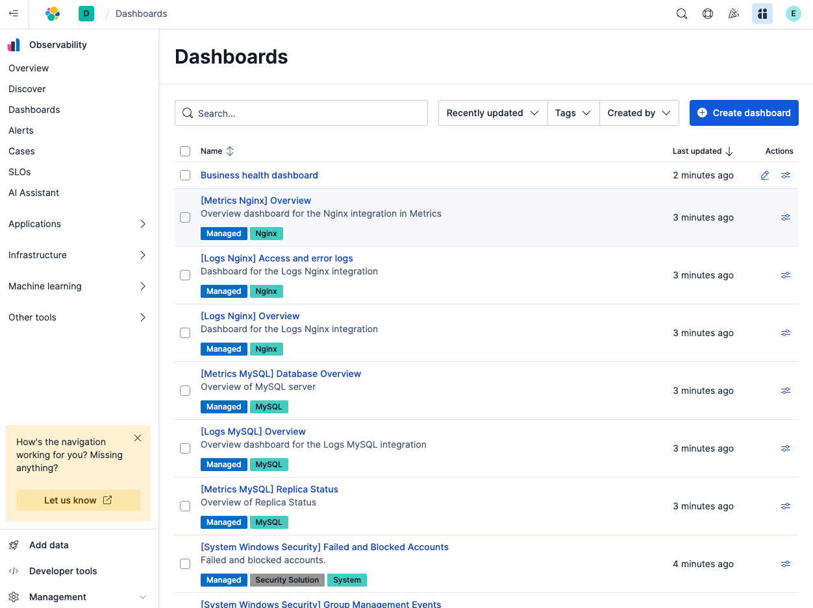
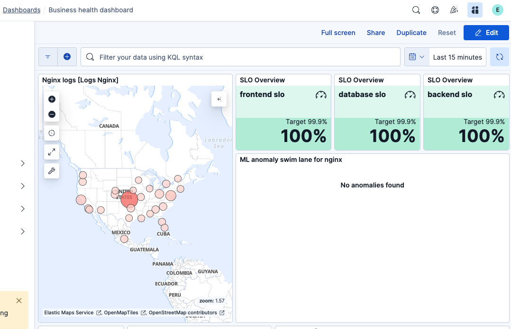

Welcome to the Elastic Logging Workshop

You're now in Kibana, the Elastic user interface.

> [!NOTE]
> Did you know: **Kibana** was named by Rashid Khan as the Swahili translation of "log cabin" - a home made of logs.

Firstly lets have a quick look at our environment.

Our eCommerce application exists as a simple three tier application, with a frontend (hosted on nginx) a backend (also hosted by nginx) and a mysql database hosted on Kubernetes. As shown below.

We are using Elastic Agent in a sidecar configuration to collect the logs from each pod.

You'll notice in Elastic that you are brought initally to the dashboard page.

Lets start by poking around in the environment. Open up the "Business Health Dashboard".

As you can see at the moment everything is green, no major issues, revenue looks to be flowing in nicely and we have a manageable number of errors.

