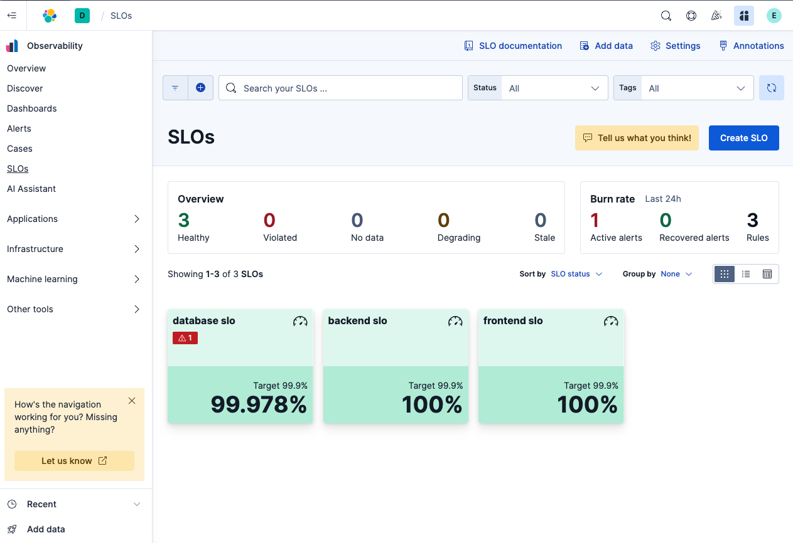
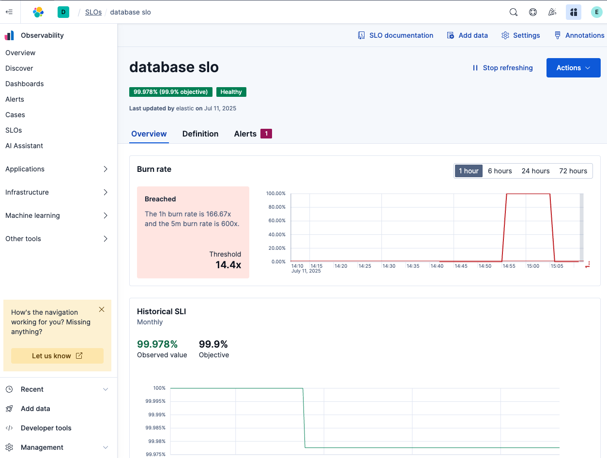
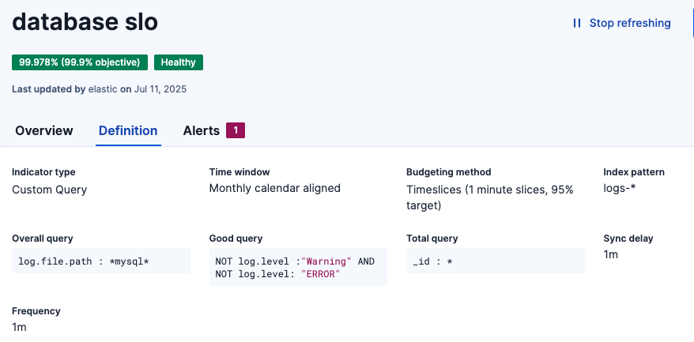

> [!WARNING]
> OH NO, THE DATABASE HAS GONE DOWN! WE NEED TO FIND OUT WHATS HAPPENING AND FAST!

Make sure the time range is set to the last hour and head over to the business health dashboard.

Notice on the business health dashboard we start top see errors in our MySQL logs immediately:

Over time you can see on the dashboard our Database SLO starts to degrade.

Heading over to Alerts - we have two alerts that have popped up. The first alert is about the Database SLO is burning down rapidly and the second alert is about the spike in error logs.

Lets take a look at how the SLO is constructed, head over to the SLO navigation on the left hand side.

Click on the Database SLO

Select "Definition"

Notice that this SLO is constructed entirely from Log data, we are looking specifically for any errors in our mysql log files.

Next up we will explore the alert and try to find the root cause of the database outage.