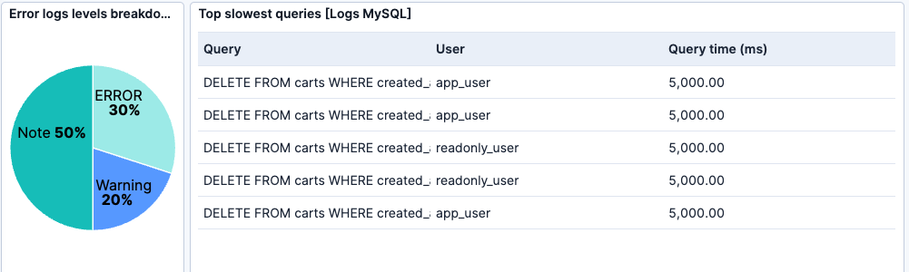
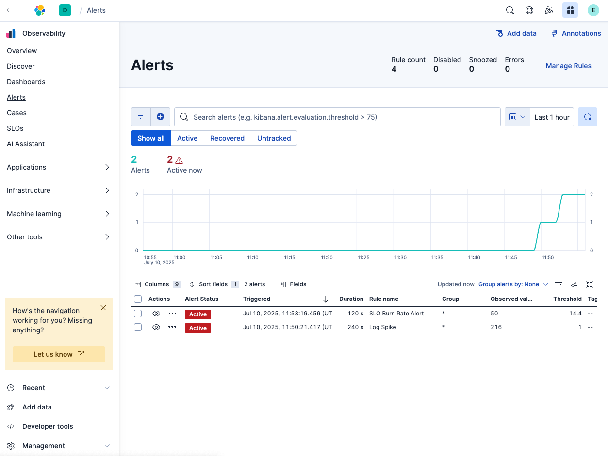

> [!WARNING]
> OH NO, THE DATABASE HAS GONE DOWN! WE NEED TO FIND OUT WHATS HAPPENING AND FAST!

Make sure the time range is set to the last hour and head over to the business health dashboard.

Notice on the business health dashboard we start top see errors in our MySQL logs immediately:

Over time you can see on the dashboard our Database SLO starts to degrade.

Heading over to Alerts - we have two alerts that have popped up. The first alert is about the Database SLO is burning down rapidly and the second alert is about the spike in error logs.

