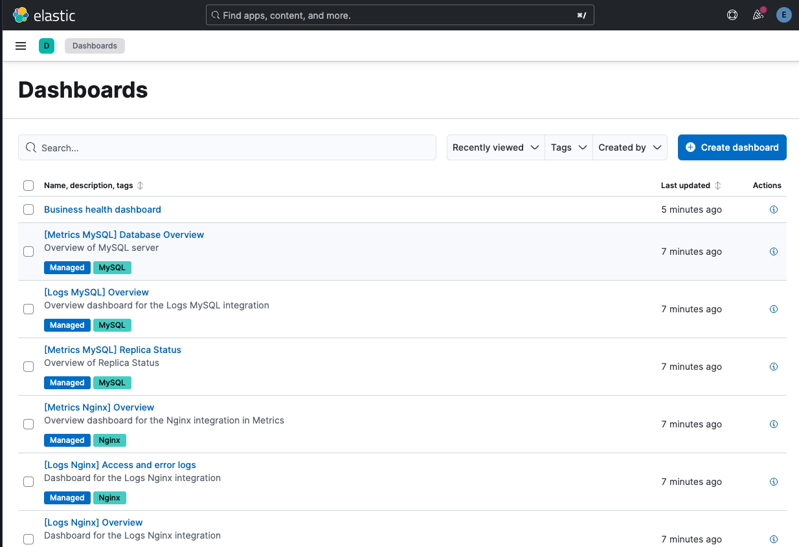
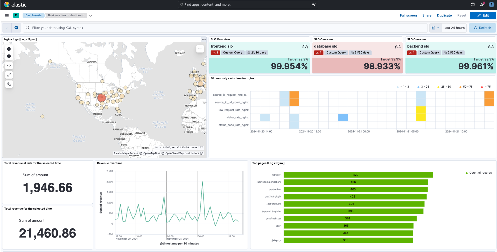
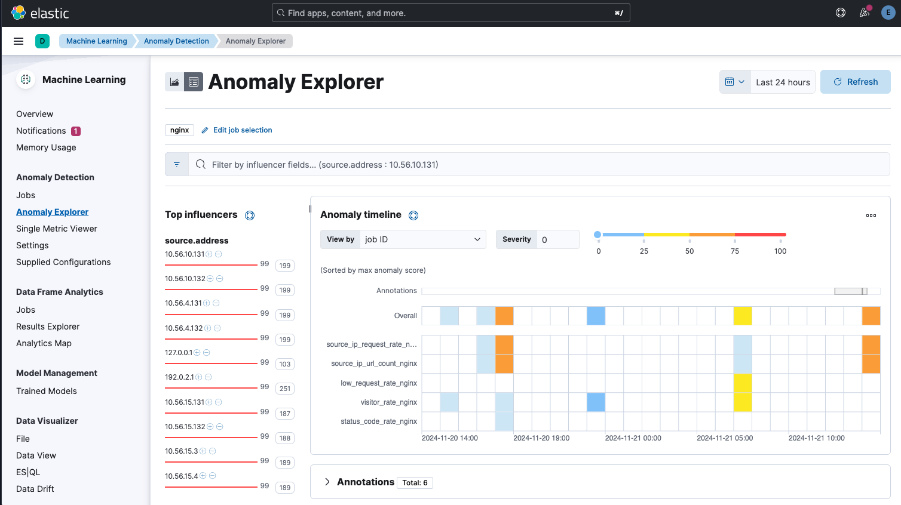
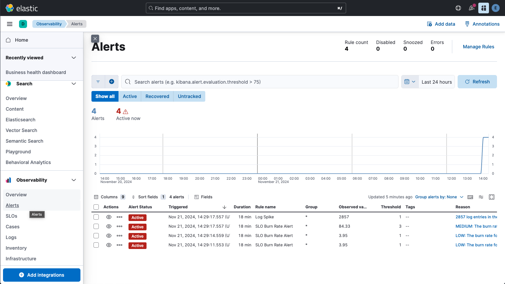
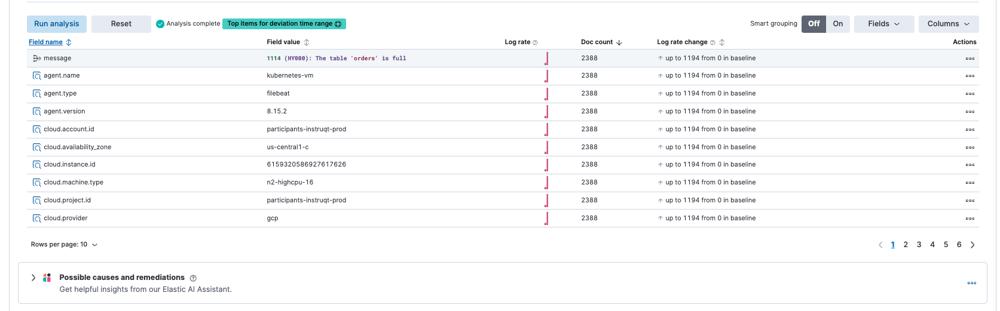
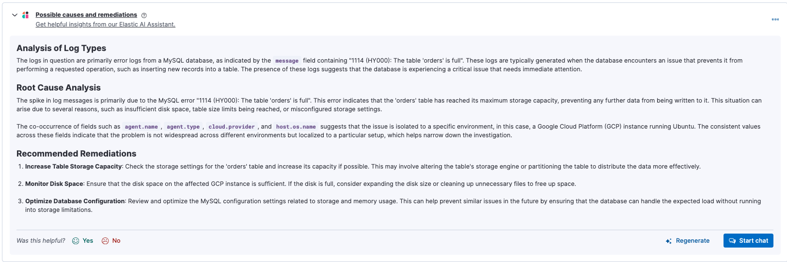
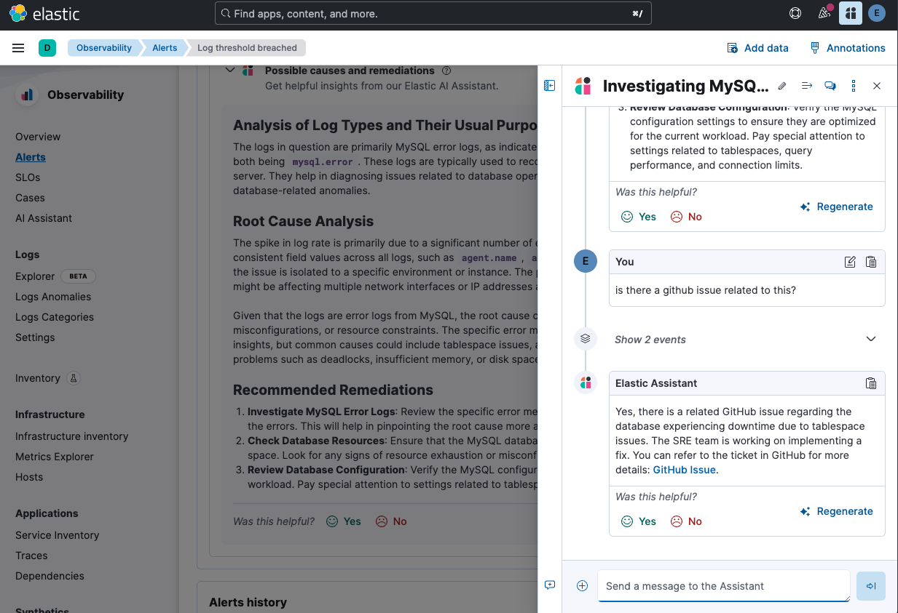
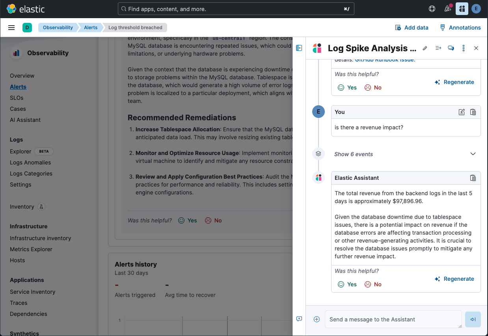

Welcome to the Nginx demo, we start the demo on the dashboard screen, lets check out our business health:

TELL (Set Context):
"Today, I'm going to walk you through how modern SRE teams can quickly identify and respond to service health issues using Elastic. We'll see how combining observability data with powerful analytics can transform the way we manage application health."

SHOW (Demonstrate):
"Let's start by looking at our Business Health Dashboard, which you can see right here at the top of our dashboards list. This is where our journey begins - it's our single pane of glass for monitoring the overall health of our business-critical services."

TELL (Reinforce Value):
"What makes this particularly powerful is that instead of jumping between different tools and dashboards, we've consolidated the most important health metrics in one place, allowing teams to spot issues faster and respond more effectively. ."

TELL (Set Context):
"As we look at our Business Health Dashboard, we can see a comprehensive view of our system's health across multiple dimensions - from geographical distribution of our services to key SLOs and database metrics."

SHOW (Demonstrate):
"Firstly lets see whats been happening over the last 24 hours. At the top of our dashboard, we have three critical SLOs that we're tracking. Let's focus on this one in the middle [point to the red SLO indicator] that's showing 98.933%. This is below our target threshold, which is immediately visible through the red coloring. Below that, we have a world map showing our service distribution, revenue metrics, and importantly, our query performance data at the bottom. We also see Anomaly Detection has found some issues this is a critical feature that helps teams proactively identify issues before they impact our SLOs "

TELL (Reinforce Value):
"What's particularly powerful here is how we've brought together business metrics, technical performance data, machine learning and user experience indicators all in one view. This allows us to quickly correlate any issues between business impact and technical problems. Next lets drill into these anomalies we've found."

TELL (Set Context):
"What you're seeing here is how Elastic revolutionizes the traditional approach to monitoring. Instead of manually creating alerts for every IP address or status code combination - which would be impossible at scale - we let machine learning do the heavy lifting."

SHOW (Demonstrate):
"Looking at our Anomaly Explorer, you can see we're tracking multiple IP addresses - each with their own unique behavioral patterns. On the right, we have an anomaly timeline that shows severity scores from 0 to 100 for each metric we're monitoring. Notice how we're tracking metrics like request rates, URL counts, and status codes simultaneously across all these IPs [point to the metrics list on the right]. These yellow and orange indicators here [point to the colored sections in the timeline] represent detected anomalies of varying severity."

TELL (Reinforce Value):
"This is a game-changer for modern SRE teams. Instead of maintaining thousands of static thresholds or writing complex monitoring rules for each IP address, we're automatically learning the normal behavior patterns for every single one. It's like having thousands of mini-analysts working 24/7, each one specialized in monitoring a specific aspect of your system. Right let's go back and look to see if we have any outstanding alerts."

TELL (Set Context):
"Our machine learning has detected several anomalies that have triggered alerts. This is where Elastic's intelligent monitoring translates raw anomaly detection into actionable insights."

SHOW (Demonstrate):
"Looking at our Alerts page, we can see four active alerts that just triggered around 14:29. What's particularly interesting is that we're seeing multiple types of alerts - a log spike showing 2857 entries in the last 5 days, and three SLO Burn Rate alerts at different severity levels. Each alert provides clear context about what's happening - for example, this medium priority alert [point to 83.8 burn rate alert] is showing us that our burn rate has exceeded our threshold across multiple time windows."

TELL (Reinforce Value):
"This multi-layered alerting approach is crucial for modern operations. Instead of getting overwhelmed with individual alerts for each anomaly we saw earlier, Elastic intelligently groups and correlates these issues into meaningful alerts with different severity levels. This helps teams prioritize their response and understand the broader impact across different time windows - from immediate issues to longer-term trends. Let's drill into the log spike to see how we can investigate further."

TELL (Set Context):
"When investigating an issue, context is everything. Here we can see that our log analysis has identified a critical database issue, along with all the relevant infrastructure details."

SHOW (Demonstrate):
"Looking at the data, we can see a MySQL error indicating that our 'orders' table is full. What's particularly helpful is that Elastic has automatically gathered all the contextual information about where this is happening - we can see it's in a GCP environment [point to cloud.provider], specifically in us-central1-c [point to availability zone], running on an n2-highcpu-16 instance [point to machine.type]. The log rate shows a significant spike - jumping up to 1194 from our baseline [point to log rate change]."

TELL (Reinforce Value):
"This level of automatic context gathering is invaluable for rapid incident response. Instead of manually piecing together information from multiple systems or running additional queries, everything our teams need for initial triage is right here. And notice at the bottom, we have an AI Assistant ready to help with possible causes and remediations - let's see what insights it can provide about this database issue."

> [!WARNING]
> NOTE To DEMO Conductor. Sort by "Field name" so that the '1114 (HY000): The table 'orders' is full' sorts to the top.

TELL (Set Context):
"This is where Elastic's AI Assistant transforms raw data into actionable insights. Instead of just showing us the error, it provides a comprehensive analysis leveraging both the log context and its understanding of database systems."

SHOW (Demonstrate):
"The Assistant breaks down the analysis into three key sections. First, it identifies the specific MySQL table issue in the logs. Then, in the Root Cause Analysis, it not only explains the technical error but correlates multiple data points - notice how it connects the agent name, type, and cloud provider to conclude this is isolated to a specific GCP environment. Finally, it provides three clear remediation steps [point to each]: increasing table storage capacity, monitoring disk space, and optimizing database configuration."

TELL (Reinforce Value):
"This AI-powered analysis represents a major evolution in incident response. Instead of engineers spending precious time researching error codes or consulting multiple documentation sources, they get immediate, contextual guidance. And if they need more specific details, they can start a chat right here [point to 'Start chat' button] to dive deeper into any of these recommendations. This significantly reduces mean time to resolution and helps prevent similar issues in the future."

> [!IMPORTANT]
> IF THE KNOWLEDGE BASE WAS CREATED CORRECTLY

TELL (Set Context):
"When investigating issues, it's crucial to know if others have encountered and potentially solved similar problems. This is where our AI Assistant's knowledge base powered by Retrieval Augmented Generation becomes particularly valuable."

SHOW (Demonstrate):
"I asked if there's a GitHub issue related to this problem, and the Assistant immediately found relevant information. It identified that there's an existing GitHub issue specifically about database tablespace issues, and even better, it tells us that the SRE team is actively working on implementing a fix [point to the response]. The Assistant provides a direct link to the GitHub issue for more details, saving precious time during incident response."

TELL (Reinforce Value):
"This integration between observability data and our knowledge base is a game-changer for incident response. Instead of searching through multiple systems or asking around for similar incidents, the AI Assistant instantly connects the dots between current issues and existing knowledge. Teams can leverage institutional knowledge and avoid duplicating work that's already been done. You can continue the conversation with follow-up questions about implementation details, timelines, or alternative solutions."

> [!IMPORTANT]
> Optional "Ask if there is an revenue impact"

TELL (Set Context):
"Now we're seeing how our AI Assistant can directly connect technical issues to business impact, which is crucial for prioritization and escalation decisions."

SHOW (Demonstrate):
"When asked about revenue impact, the Assistant immediately analyzed the backend logs and identified nearly $98,000 in revenue flowing through this system over the past 5 days. It also provides clear context about how the tablespace issues could be affecting transaction processing [point to the impact analysis]. This combines technical metrics with business metrics to give us a complete picture of the incident's severity."

TELL (Reinforce Value):
"This ability to instantly quantify business impact transforms incident response from a purely technical exercise into business-driven decision making. Teams can now prioritize fixes based on real revenue numbers rather than just technical severity, and communicate the urgency to stakeholders in financial terms they understand. Let's look at what actions we should take based on this insight."
