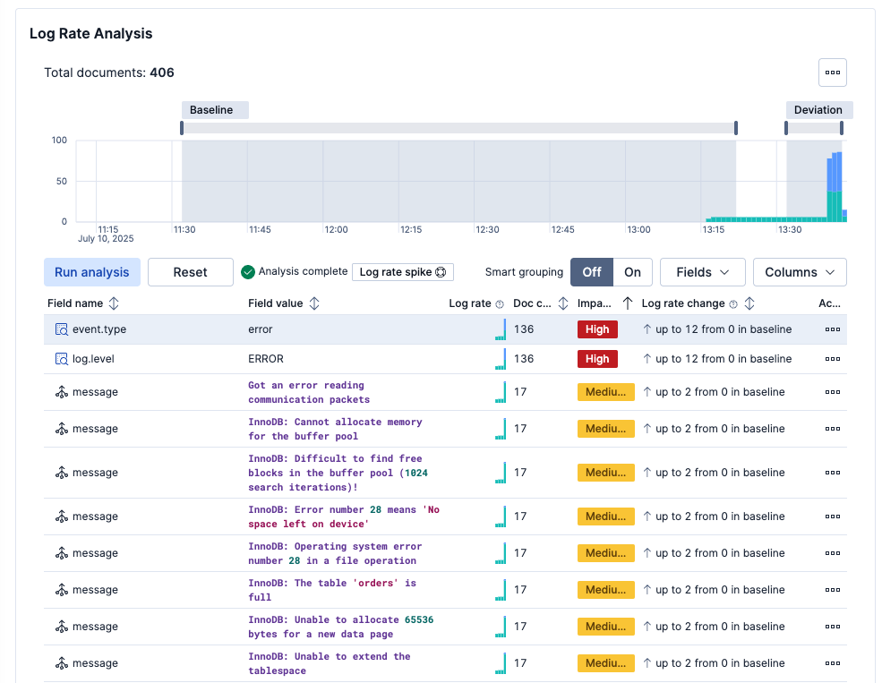
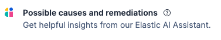
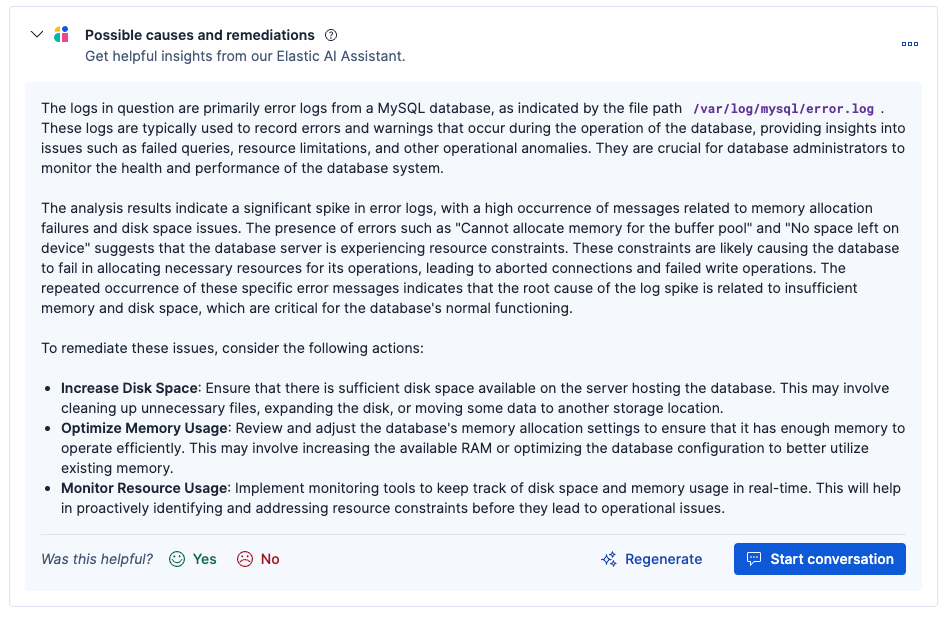
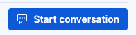
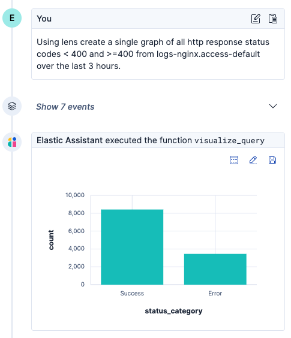
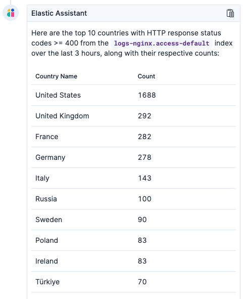

Right lets take a look at this "Spike in Database Errors" Alert, when we click on the ... and click "View Alert Details" we can see Elastic immediately runs our root cause analysis engine.

Wow - we can see a lot of new error messages in the database logs, this is not good news.  The problem is I don't fully understand these logs, lets use our AI Assistant to translate these into something I can understand.

Click on "Possible causes and remediations" to call in reinforcements.

The anomalous messages in our logs and only those messages are sent to the AI Assistant for analysis and it conducts an analysis for us.

Now lets check and see if this is impacting our front end, click on "Start Conversation"

Now lets ask the assistant:

> [!NOTE]
> Using lens create a single graph of all http response status codes < 400 and >=400 from logs-nginx.access-default over the last 3 hours.

So we can see this is affecting quite a few people on the frontend, not a good sign.  Now lets also see if the impact is global.

Ask the assistant:

> [!NOTE]
> What are the top 10 source.geo.country_name with http.response.status.code>=400 over the last 3 hours. Use logs-nginx.access-default. Provide counts for each country name.

Ooof, this is clearly a global issue, we need to get moving on this fast.

Next lets look at teaching the AI Assistant a few tricks so it can help us with the business impact.
