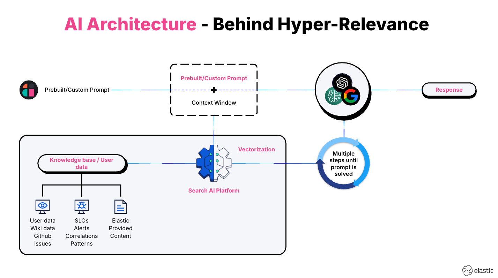
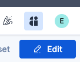
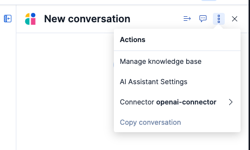
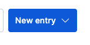
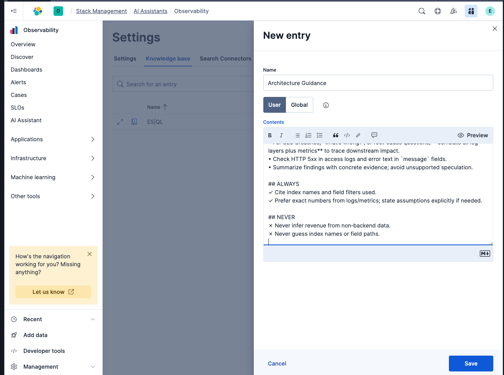
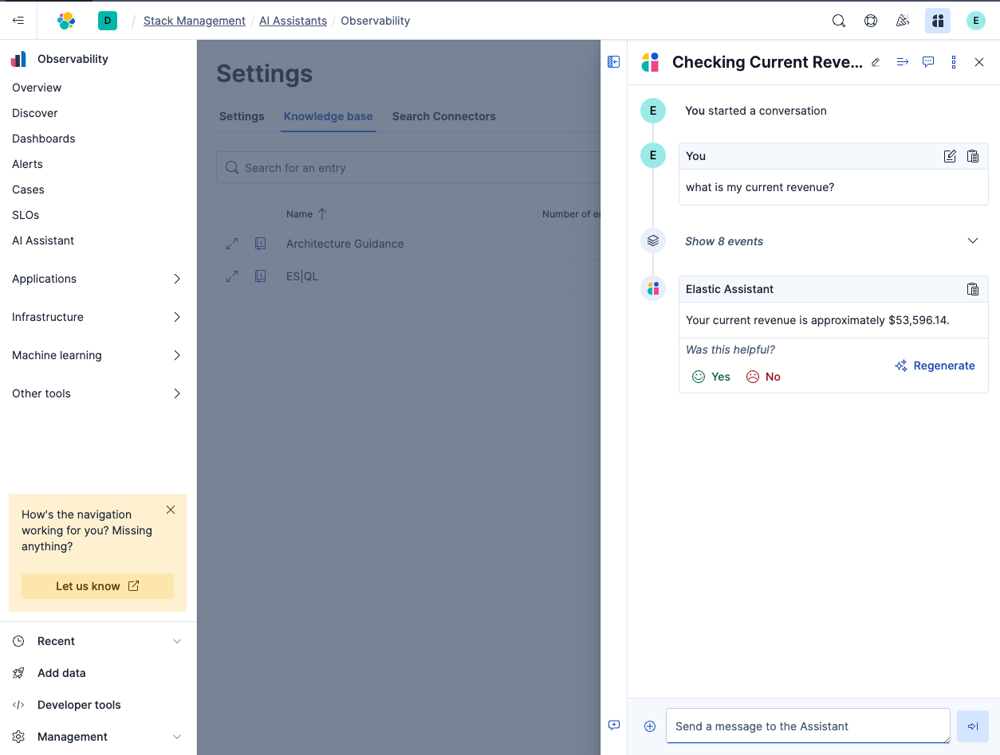

Elastics AI Assistant uses a process called Retrieval Augmented Generator to get the most relevant results for any problem you are having.

What we do is any documents in the knowledge base or imported using a search connector from GitHub, Jira etc instantly get vectorized, this allows us to perform semntic search and use the information in the context of any conversation we are having with the AI Assistant. See the architecture diagram below.



To add knowledge to the AI Assistants knowledge base head over to the AI Assistant button in the top right corner of Kibana:



Click on the three dots:



Select "Manage Knowledge Base"

Close the Assistant, and select "New Entry"



Title the new entry "Architecture Guidance" and copy and paste the content from below.


```
[importance:10]
ENVIRONMENT CONTEXT
Data sources: *logs‑only*  Elastic cluster for a 3‑tier app (Frontend, Backend, MySQL).
Critical KPI field  **revenue**
Exists **only** in backend NGINX *access* logs
Index: logs‑nginx.access-default
Selector: log.file.path LIKE "*backend*"
Whenever a user asks about revenue (totals, trends, anomalies, etc.), query **exactly this field** and nowhere else.

INDEX LOOKUP
FE access logs , logs‑nginx.access-default, filter: log.file.path LIKE "*frontend*"
FE error logs , logs‑nginx.error-default, errors in message
BE access logs, logs‑nginx.access-default, filter: log.file.path LIKE "*backend*", has revenue
BE error logs, logs‑nginx.error-default, errors in message
MySQL error logs, logs‑mysql.error-default, errors in message
MySQL slow logs, logs‑mysql.slowlog-default, identifies slow queries

DIAGNOSTIC GUIDANCE
For SLO breaches, “what’s wrong?”, or root‑cause questions, **correlate all log layers plus metrics** to trace downstream impact.
Check HTTP 5xx in access logs and error text in `message` fields.
Summarize findings with concrete evidence; avoid unsupported speculation.

ALWAYS
Cite index names and field filters used.
Prefer exact numbers from logs/metrics; state assumptions explicitly if needed.

NEVER
Never infer revenue from non‑backend data.
Never guess index names or field paths.
```

Example below:



Now we can ask the AI Assistant about revenue data from our log files.



