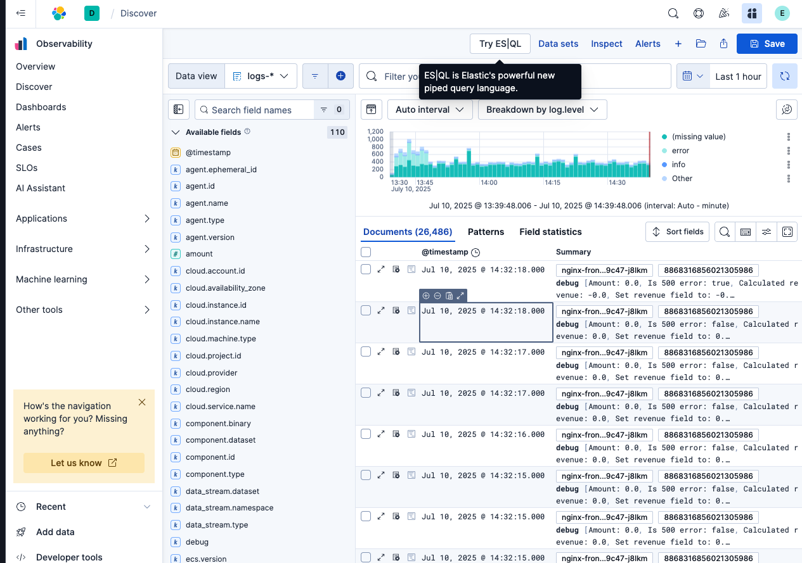
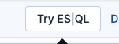

For our final assignment we are going to be using Discover to find which users were impacted because of the database outage.

Firstly select "Discover" from the left hand menu:



Click "Try ES|QL"



Put the following query in (note that the date in here ".ds-logs-mysql.error-default-2025.07.10-000001" and here " .ds-logs-nginx.access-default-2025.07.10-000001" will need to be changed to todays date):

```
from logs-mysql.slowlog-default | LOOKUP JOIN .ds-logs-mysql.error-default-2025.07.10-000001 ON mysql.thread_id | where mysql.thread_id is not null | LOOKUP JOIN .ds-logs-nginx.access-default-2025.07.10-000001 ON request_id | KEEP user.name, mysql.slowlog.query
```

Now we can see the users that were affected by our database outage and which queries were affected using the new Lookup Join function!