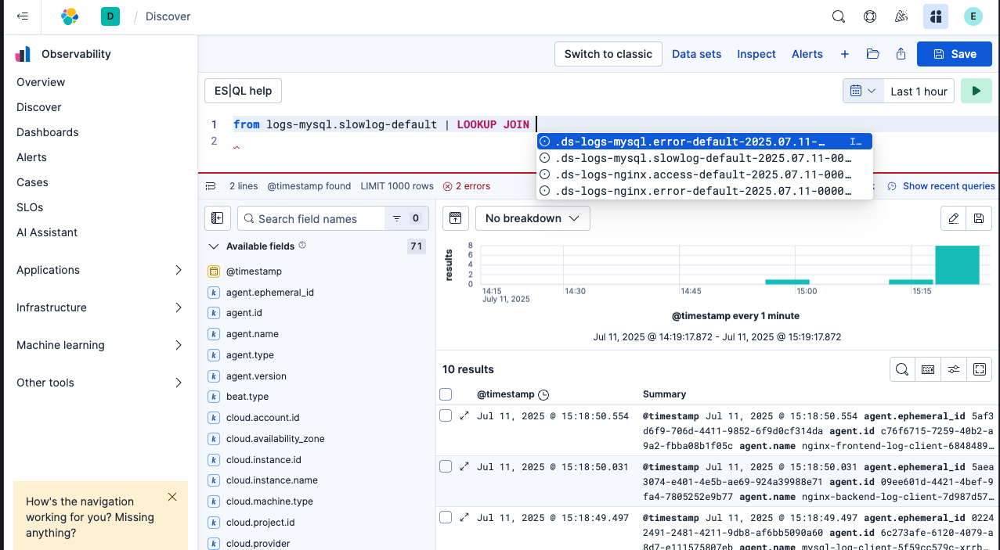
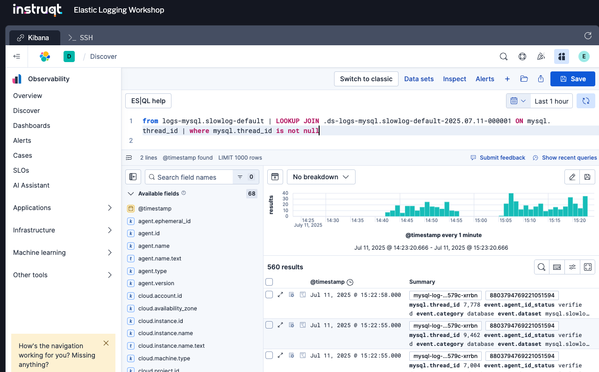
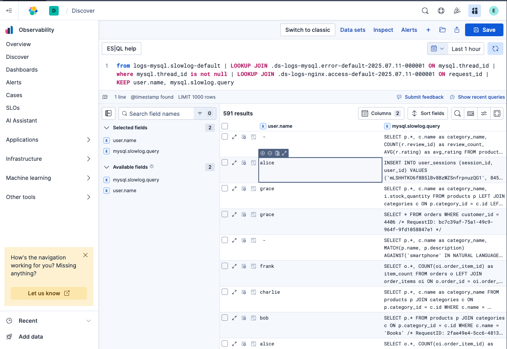

For our final assignment we are going to be using Discover to find which users were impacted because of the database outage.

Firstly select "Discover" from the left hand menu:


Click "Try ES|QL"


In this exercise we are going to use ES|QL to find out the user impact. We have two kinds of Database logs in Elastic, slowlogs and error logs. Error logs will contain a thread id, so we can match the error to query details in the slow log using the thread id by using JOINs in Elastic.

Lets start off really simple by just querying the slowlogs

```
from logs-mysql.slowlog-default
```

Next lets join the MySQL slow logs to the  MySQL error logs. Luckily Elastic Discover has auto complete functionality so this should be easy put a pipe next to the current ES|QL command "|' and then type "LOOKUP JOIN", the auto complete should show up, we want to join the slowlog to the error log on the thread id. Like this



After selecting the slowlog from the autocomplete, add "ON mysql.thread_id | where mysql.thread_id is not null".  Like so:



This completes the first part of the query, you can run this and check the results.

Next we are sending a request ID into our MySQL logs, this can help us join our MySQL logs to our frontend logs. Elastic fully supports multiple join statements so we can easily do this.

Put a "| LOOKUP JOIN" and then  follow the auto complete to add the "logs-nginx.access" logs to the query.

Finally add "ON request_id | KEEP user.name, mysql.slowlog.query"

The full query should look something like this:

> [!NOTE]
> from logs-mysql.slowlog-default | LOOKUP JOIN .ds-logs-mysql.error-default-2025.07.10-000001 ON mysql.thread_id | where mysql.thread_id is not null | LOOKUP JOIN .ds-logs-nginx.access-default-2025.07.10-000001 ON request_id | KEEP user.name, mysql.slowlog.query

Now we can see the users that were affected by our database outage and which queries were affected using the new Lookup Join function!


